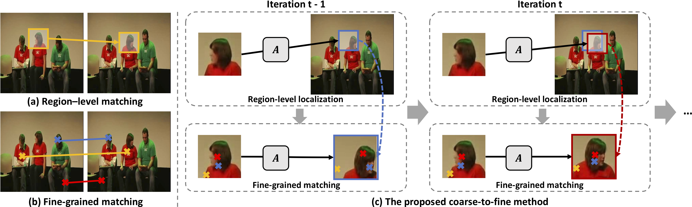
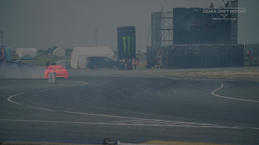
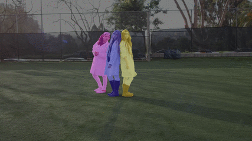

# Joint-task Self-supervised Learning for Temporal Correspondence

[**Project**](https://sites.google.com/view/uvc2019) | [**Paper**](https://papers.nips.cc/paper/8324-joint-task-self-supervised-learning-for-temporal-correspondence.pdf)

# Overview



[Joint-task Self-supervised Learning for Temporal Correspondence]()

[Xueting Li*](https://sunshineatnoon.github.io/), [Sifei Liu*](https://www.sifeiliu.net/), [Shalini De Mello](https://research.nvidia.com/person/shalini-gupta), [Xiaolong Wang](https://www.cs.cmu.edu/~xiaolonw/), [Jan Kautz](http://jankautz.com/), [Ming-Hsuan Yang](http://faculty.ucmerced.edu/mhyang/).

(* equal contributions)

In  Neural Information Processing Systems (NeurIPS), 2019.

# Citation
If you use our code in your research, please use the following BibTex:

```
@inproceedings{uvc_2019,
    Author = {Xueting Li and Sifei Liu and Shalini De Mello and Xiaolong Wang and Jan Kautz and Ming-Hsuan Yang},
    Title = {Joint-task Self-supervised Learning for Temporal Correspondence},
    Booktitle = {NeurIPS},
    Year = {2019},
}
```

# Instance segmentation propagation on DAVIS2017
<p float="left">
  
  
  
</p>


| Method | J_mean | J_recall | J_decay | F_mean | F_recall | F_decay |
| ------------- | ------------- | ------------- | ------------- | ------------- | ------------- | ------------- |
| Ours | 0.563 | 0.650 | 0.289 | 0.592 | 0.641 | 0.354 |
| Ours - track | 0.577 | 0.683 | 0.263 | 0.613 | 0.698 | 0.324 |

# Prerequisites
The code is tested in the following environment:
- Ubuntu 16.04
- Pytorch 1.1.0, [tqdm](https://github.com/tqdm/tqdm), scipy 1.2.1

# Testing on DAVIS2017
## Testing without tracking
To test on DAVIS2017 for instance segmentation mask propagation, please run:
```
python test.py -d /workspace/DAVIS/ -s 480
```
Important parameters:
- `-c`: checkpoint path.
- `-o`: results path.
- `-d`: DAVIS 2017 dataset path.
- `-s`: test resolution, all results in the paper are tested on 480p images, i.e. `-s 480`.

Please check the `test.py` file for other parameters.

## Testing with tracking
To test on DAVIS2017 by tracking & propagation, please run:
```
python test_with_track.py -d /workspace/DAVIS/ -s 480
```
Similar parameters as `test.py`, please see the `test_with_track.py` for details.

# Testing on the VIP dataset

To test on VIP, please run the following command with your own VIP path:

```
python test_mask_vip.py -o results/VIP/category/ --scale_size 560 560 --pre_num 1 -d /DATA/VIP/VIP_Fine/Images/ --val_txt /DATA/VIP/VIP_Fine/lists/val_videos.txt -c weights/checkpoint_latest.pth.tar
```
and then:
```
python eval_vip.py -g DATA/VIP/VIP_Fine/Annotations/Category_ids/ -p results/VIP/category/
````

# Testing on the JHMDB dataset
Please check out [this](https://github.com/Liusifei/UVC/tree/jhmdb) branch. The code is borrowed from [TimeCycle](https://github.com/xiaolonw/TimeCycle).

# Training on Kinetics

## Dataset

We use the [kinetics dataset](https://deepmind.com/research/open-source/open-source-datasets/kinetics/) for training.

## Training command

```
python track_match_v1.py --wepoch 10 --nepoch 30 -c match_track_switch --batchsize 40 --coord_switch 0 --lc 0.3
```

# Acknowledgements
- This code is based on [TPN](https://arxiv.org/pdf/1804.08758.pdf) and [TimeCycle](https://github.com/xiaolonw/TimeCycle).
- For any issues, please contact xli75@ucmerced.edu or sifeil@nvidia.com.
